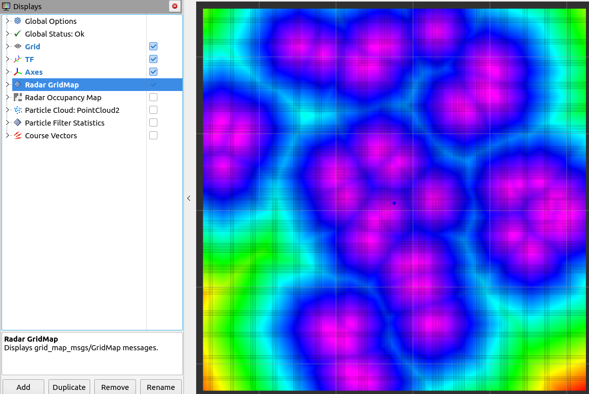
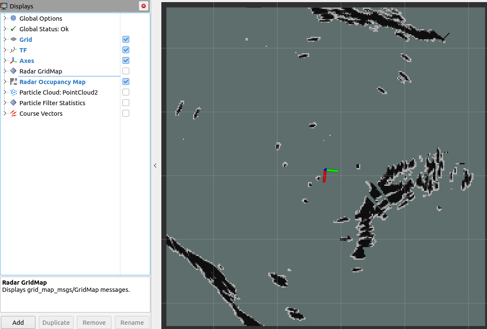
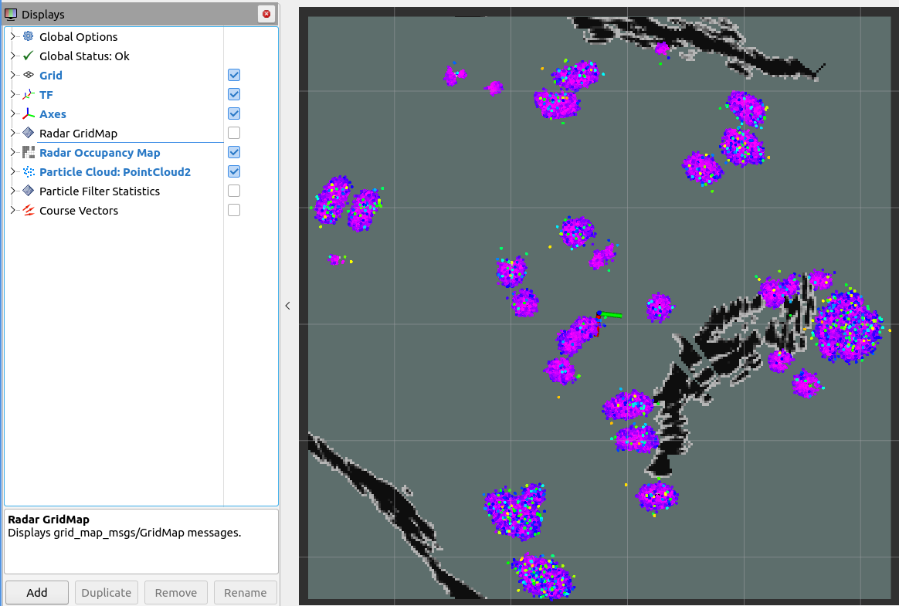
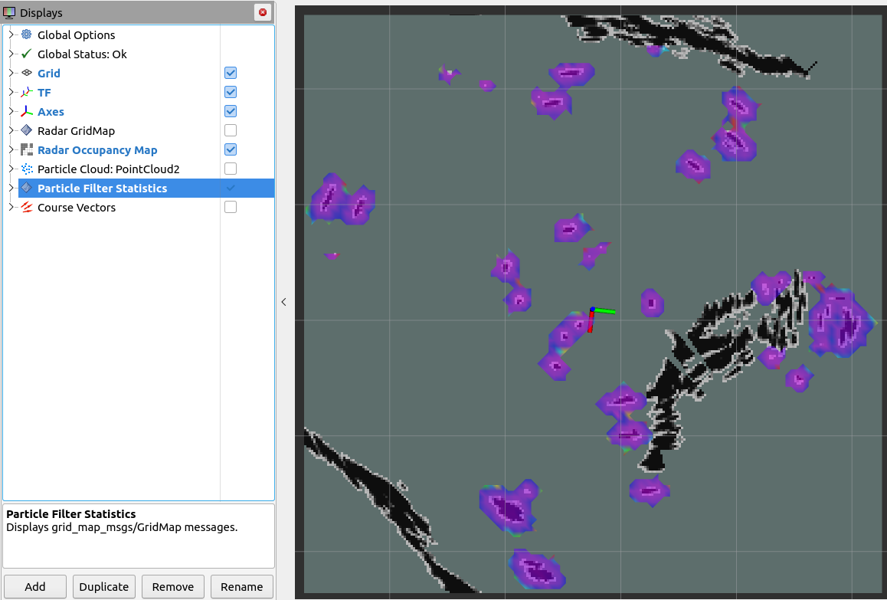
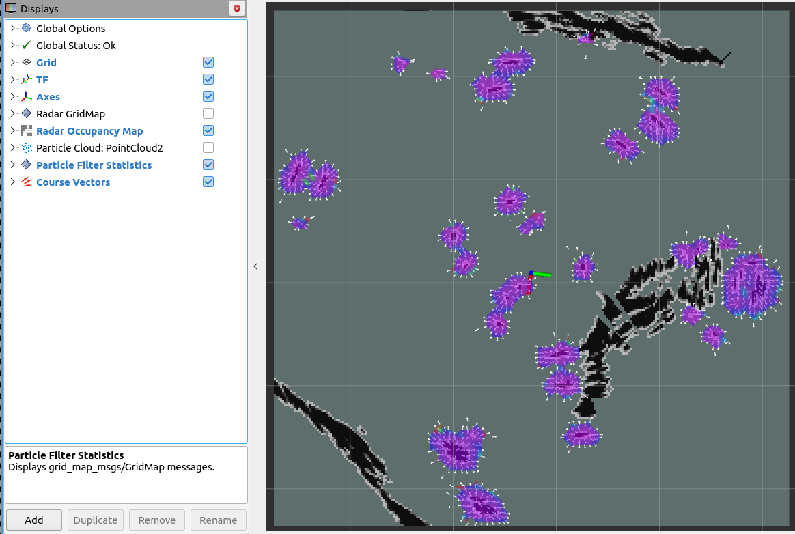

# echoflow
[](https://youtu.be/GvkZeJmIi4c)

[Watch on YouTube](https://youtu.be/GvkZeJmIi4c)


**echoflow** is a ROS 2 package designed to transform marine radar sector data into a real-time, 2D grid map for navigation and environmental awareness, and run a multi-target particle filter for tracking dynamic obstacles using that map.

Echoflow consists of a mapping node, `radar_grid_map`, and a particle filter node, `particle_filter`.

The `radar_grid_map` node listens to radar sector messages, applies optional near-field clutter filtering, transforms the data into a global map frame using TF2, and publishes both a detailed `GridMap` and a simplified `OccupancyGrid` suitable for further path planning, SLAM, or tracking algorithms.

The `particle_filter` node spawns particles with random position and course angles on the map where a radar return is detected and iteratively updates the particle filter until the filter converges on an estimated position and course for each target. It also filters out large blobs from the radar map, which can be used to filter out large static areas, e.g. shorelines. It publishes a set of statistics on the particles which are used to optimize the particle filter performance. Random particles are also continuously spawned so that the filter reacts to newly detected obstacles.

Complete API doccumentaiton can be found at: [https://seawardscience.github.io/echoflow/](https://seawardscience.github.io/echoflow/)

---

## Installation

To install `echoflow`:

```bash
# Clone the repository into your workspace src/
cd ~/ros2_ws/src
git clone https://github.com/SeawardScience/echoflow

# Install dependencies
cd ~/ros2_ws
rosdep install --from-paths src --ignore-src -r -y
```

### Compiling

To build the package and all required dependencies:

```bash
cd <path to your workspace>
colcon build --packages-select echoflow
source install/setup.bash
```

You may also wish to build with tests and warnings enabled:

```bash
colcon build --packages-select echoflow --cmake-args -DCMAKE_BUILD_TYPE=Release
```

---

## Running the Package


After sourcing your workspace, you can start the `flow_tracker` node which starts both the `particle_filter` and the `radar_grid_map` (with appropriate ros args).

A launchfile has been provided to launch both nodes with the parameter configuration file and launch `rviz2` with the echoflow rviz configuration:

```bash
ros2 launch echoflow flow_tracker.launch.xml radar_ns:=<your radar namespace>
```

You will need to set the `radar_ns` arg match the namespace for your radar data topics.

Make sure appropriate TF data (e.g., `map -> radar_frame`) and radar sector topics are available.

### Example Dataset

An example dataset is available [here](https://krasno.cloud/seaward_data/echoflow/fernandina_20250427_110627.zip) for testing and demonstaration puroposes.  You will be prompted for a username and a password

```
user: echoflow
password: fernandina
```

Once downloaded, you can extract the file and replay it using
```
ros2 bag play 'fernandina_20250427_110627'
```

once playing use the following to run echoflow

```bash
ros2 launch echoflow flow_tracker.launch.xml radar_ns:=aura/perception/sensors/halo_a
```
or
```bash
ros2 launch echoflow flow_tracker.launch.xml radar_ns:=aura/perception/sensors/halo_b
```

---

## Nodes

### radar_grid_map Node

This node processes incoming marine radar sectors and builds a continuously updating 2D map.


A launchfile has been provided to run the `radar_grid_map` node standalone with the parameter configuration file and launch `rviz2` with the echoflow rviz configuration:

```bash
ros2 launch echoflow radar_grid_map.launch.xml radar_ns:=<your radar namespace>
```

You will need to set the `radar_ns` arg match the namespace for your radar data topics.

Make sure appropriate TF data (e.g., `map -> base_link`) and radar sector topics are available.


#### Published Topics

| Topic                  | Message Type                          | Description                         |
|------------------------|---------------------------------------|-------------------------------------|
| `occupancy_grid`       | `nav_msgs::msg::OccupancyGrid`        | Simplified occupancy representation |
| `radar_grid_map`       | `grid_map_msgs::msg::GridMap`         | Full radar grid map                 |

#### Subscribed Topics

| Topic                  | Message Type                          | Description                         |
|------------------------|---------------------------------------|-------------------------------------|
| `data`                 | `marine_sensor_msgs::msg::RadarSector`| Incoming radar sector scans         |

The above correspond to the standards set in the UNH marine radar messages. Therefore you should run this node in the namespace of the desired radar channel. For example:

```bash
ros2 run echoflow radar_grid_map --ros-args -r __ns:=/aura/perception/sensors/halo_a
```

---

#### TF Requirements

This node relies on TF2 to transform incoming radar data from its native frame into the global map frame.

To function correctly, the following TFs **must be available and actively published**:

- A transform from the radar's frame (e.g., `halo`, `base_link`, or `sensor_frame`) to the configured `map.frame_id` (default: `"map"`).
- These transforms should be **static or real-time**, depending on whether your radar is fixed or moving.

##### Example TF Tree

```
map
└── base_link
    └── halo
```

##### Expected Setup

If your radar messages are in the `halo` frame, and you want to map in the `map` frame:

- You must publish the following transform:

```bash
ros2 run tf2_ros static_transform_publisher \
  0 0 0 0 0 0 map halo
```

Or, more likely, dynamically broadcast it from your navigation or localization system.

##### Parameters Related to TF

- `map.frame_id` — this is the **target** frame for the radar grid map.
- Incoming radar messages should have `header.frame_id` set to the **source** frame.

> ⚠️ If TF lookups fail, the node will not process radar messages until a valid transform becomes available.

#### Parameters

| Parameter Name                     | Type          | Default Value  | Description                                          |
|------------------------------------|---------------|----------------|------------------------------------------------------|
| `map.frame_id`                     | `std::string` | `"map"`        | The fixed frame for the output grid map.             |
| `map.length`                       | `float`       | `10000.0`      | Length of the map area in meters.                    |
| `map.width`                        | `float`       | `10000.0`      | Width of the map area in meters.                     |
| `map.resolution`                   | `float`       | `10.0`         | Resolution (cell size) of the map in meters.         |
| `map.pub_interval`                 | `float`       | `0.1`          | Time between costmap publication updates (seconds).  |
| `filter.near_clutter_range`        | `float`       | `30.0`         | Maximum range in meters for clutter filtering.       |
| `max_queue_size`                   | `int`         | `1000`         | Maximum radar message queue length.                  |

Example configuration snippet:

```yaml
map:
  frame_id: "map"
  length: 10000.0
  width: 10000.0
  resolution: 10.0
  pub_interval: 0.1

filter:
  near_clutter_range: 30.0

max_queue_size: 1000
```

### particle_filter Node

This node uses the 2D map from the `radar_grid_map` node to run a particle filter for tracking multiple dynamic targets.

#### Published Topics

| Topic                       | Message Type                    | Description                                   |
|-----------------------------|---------------------------------|-----------------------------------------------|
| `particle_cloud`            | `sensor_msgs::msg::PointCloud2` | Particle point cloud                          |
| `particle_filter_statistics`| `grid_map_msgs::msg::GridMap`   | Particle filter statistics                    |
| `cell_vector_field`         | `geometry_msgs::msg::PoseArray` | Displays vector showing mean course angle per cell |
| `particle_vector_field`     | `geometry_msgs::msg::PoseArray` | Displays vector showing course angle per particle  |

#### Subscribed Topics

None. The `particle_filter` node accesses the radar grid map using a shared pointer to the map between nodes for efficiency.


#### Parameters

@note  HINT:  The particle filter parameters (except for num_particles) can be tuned durring runtime using rqt_dynamic_reconfigure

| Parameter Name                            | Type          | Default Value | Description                                                         |
|-------------------------------------------|---------------|---------------|---------------------------------------------------------------------|
| `particle_filter.density_feedback_factor` | `float`       | 0.8           | Density (particles/m^2) at which the weight of a particle will be reduced by half. Lower this value if you have issues with particles too aggressively clustering on single targets. |
| `particle_filter.initial_max_speed`       | `float`       | 20.0          | Maximum speed (m/s) assigned to particles during initialization.    |
| `particle_filter.maximum_target_size`     | `float`       | 200.0         | Maximum physical size (in meters) for a trackable target blob. Used to reduce computational load on large targets like shorelines. |
| `particle_filter.noise_std_position`      | `float`       | 0.1           | Standard deviation (m) of positional noise added during resampling.         |
| `particle_filter.noise_std_speed`         | `float`       | 0.2           | Standard deviation (m/s) of speed noise added during resampling.            |
| `particle_filter.noise_std_yaw`           | `float`       | 0.05          | Standard deviation (radians) of yaw angle noise added during resampling.    |
| `particle_filter.noise_std_yaw_rate`      | `float`       | 0.0           | Standard deviation (radians/sec) of yaw rate noise added during resampling. |
| `particle_filter.num_particles`           | `int`         | 100000        | Total number of particles used in the filter.
| `particle_filter.observation_sigma`       | `float`       | 50.0          | Standard deviation (m) of the observation likelihood model.
| `particle_filter.seed_fraction`           | `float`       | 0.001         | Fraction of particles (per second) that are reseeded with random poses on each resample step Increase this value to more quickly lock on to newly detected targets. |
| `particle_filter.update_interval`         | `float`       | 0.2           | Time (in seconds) between particle weight updates.
| `particle_filter.weight_decay_half_life`  | `float`       | 3.0           | Half-life (in seconds) for exponential decay of particle weights. Lower values cause weights to fade more quickly over time. Generally, this should be on the order of the radar sweep time. |
| `particle_filter_statistics.frame_id`     | `std::string` | `"map"`       | Coordinate frame in which the particle statistics map is published.         |
| `particle_filter_statistics.pub_interval` | `float`       | 0.5           | Time interval (in seconds) between publishing the statistics map.           |
| `particle_filter_statistics.resolution`   | `float`       | 25.0          | Resolution of each grid cell (in meters).                                   |

Example configuration snippet:

```yaml
particle_filter:
  density_feedback_factor: 0.8
  initial_max_speed: 20.0
  maximum_target_size: 200.0
  noise_std_position: 0.1
  noise_std_speed: 0.2
  noise_std_yaw: 0.05
  noise_std_yaw_rate: 0.0
  num_particles: 100000
  observation_sigma: 50.0
  seed_fraction: 0.001
  update_interval: 0.2
  weight_decay_half_life: 3.0
particle_filter_statistics:
  frame_id: map
  pub_interval: 0.5
  resolution: 25.0
```


#### Particle Filter Statistics

The `particle_filter` node publishes a set of metrics calculated from the particles. These metrics are published as a separate grid map containing multiple layers, each layer corresponding to a particular metric. These metrics can be visualized in Rviz.

Metrics are calculated for any cell of the grid containing at least one particle. All metrics are `NaN` for cells where no particles exist.

| Metric             | Layer Name             | Data Type | Description                                                                             |
|--------------------|------------------------|-----------|-----------------------------------------------------------------------------------------|
| Particles per cell | `particles_per_cell`   | `int`     | Number of particles in cell.                                                            |
| Particle age       | `particle_age_mean`    | `float`   | Mean age of particles in cell (how long ago they were first spawned) (arithmetic mean). |
|                    | `particle_age_ssdm`    | `float`   | Sum of squared deviations from mean (used for calculating standard deviation).          |
|                    | `particle_age_std_dev` | `float`   | Standard deviation of age of particles in cell.                                         |
| X position         | `x_position_mean`      | `float`   | Mean x-position of particle location within cell (arithmetic mean).                     |
|                    | `x_position_ssdm`      | `float`   | Sum of squared deviations from mean (used for calculating standard deviation).          |
|                    | `x_position_std_dev`   | `float`   | Standard deviation of x-position of particles in cell.                                  |
| Y position         | `y_position_mean`      | `float`   | Mean y-position of particle location within cell (arithmetic mean).                     |
|                    | `y_position_ssdm`      | `float`   | Sum of squared deviations from mean (used for calculating standard deviation).          |
|                    | `y_position_std_dev`   | `float`   | Standard deviation of y-position of particles in cell.                                  |
| Speed              | `speed_mean`           | `float`   | Mean of speed of particles in cell (arithmetic mean).                                   |
|                    | `speed_ssdm`           | `float`   | Sum of squared deviations from mean (used for calculating standard deviation).          |
|                    | `speed_std_dev`        | `float`   | Standard deviation of speed of particles in cell.                                       |
| Course             | `course_mean`          | `float`   | Mean course angle of particles in cell (circular mean).                                 |
|                    | `course_std_dev`       | `float`   | Standard deviation of course angle of particles in cell (circular standard deviation).  |
|                    | `course_sines`         | `float`   | Sum of sines of course angles (used for calculating circular statistics).               |
|                    | `course_cosines`       | `float`   | Sum of cosines of course angles (used for calculating circular statistics). The sines and cosines of the angles represent their conversion from polar to Cartesian coordinates for calculating the circular mean, variance, and standard deviation. |


---

## Services

Currently, this node does not provide ROS2 services.

---

## Visualization

The visualization for this package is done in `rviz2`. A config file is provided which sets up all the display plugins needed to visualize the data.

### Radar GridMap

This display shows the Euclidean Distance Transform (EDT) layer of the `radar_grid_map`.



### Radar Occupancy Map

This display shows an occupancy map of the current grid map, showing where on the map radar returns exist.



### Particle Cloud

This displays a PointCloud2 visualization of the particles spawned on the map.



### Particle Filter Statistics

This displays a heatmap of the selected particle filter statistics layer. Change the Color Layer selection to visualize different metrics for the particle filter. The default metric visualized is the mean speed per cell.



### Course Vectors

This displays a vector field of the course angles. The default topic to display is the mean course angle per cell in the particle statistics map, called `cell_vector_field`. You can also display the course angle for each individual particle by selecting the `particle_vector_field` topic.



---

## Example Use Cases

- Real-time mapping of harbor environments from marine radar
- Providing occupancy grids for obstacle avoidance on ASVs (Autonomous Surface Vessels)
- Feeding particle filters or SLAM algorithms with radar-derived data
- Situational awareness systems for marine robotics

---

## Contributing

We welcome contributions!
Please read the [CONTRIBUTING.md](CONTRIBUTING.md) guidelines to get started.

When making contributions, remember:
- Follow the [Semantic Versioning 2.0](https://semver.org/) model.
- Ensure all changes maintain deployability of the `master` branch.
- Keep documentation (README, Doxygen comments) up to date.
- Use `ament_cpplint` to ensure your code matches the style guidlines.


## Generating Documentation

Documentation is auto-generated using Doxygen. Doxygen can be installed from `apt` with:

`sudo apt install doxygen`

You will also need to install LaTeX, Ghostscript, and dvips in order to compile the math formulas in the documentation (more details in the [Doxygen manual](https://www.doxygen.nl/manual/formulas.html)).
All necessary packages can be installed by the following:

`sudo apt install texlive texlive-latex-extras`

---

## License

This project is licensed under the [LICENSE](LICENSE) provided in this repository.

---

## Credits

Developed by [Seaward Science](https://seaward.science/) for University of New Hampshire Center for Coastal and Ocean Mapping [CCOM](https://www.ccom.unh.edu/)

### Authors
- Dr. Kristopher Krasnosky (lead software engineer)
- Antonella Wilby (software developer)
- Jake Bonney (software developer)
